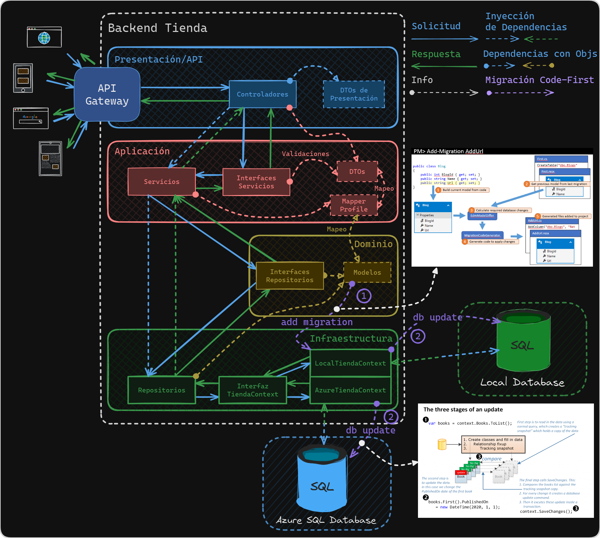
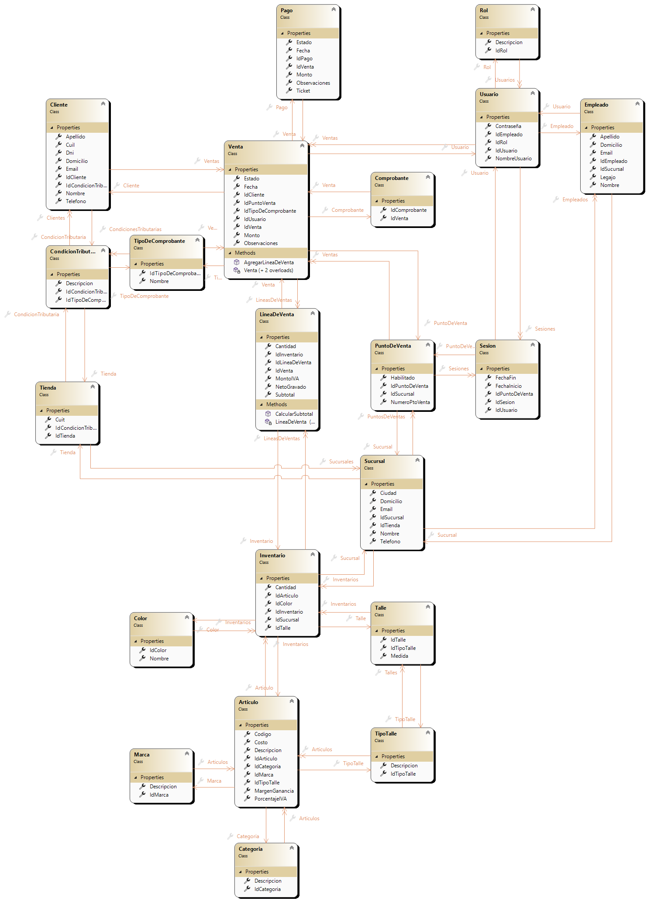
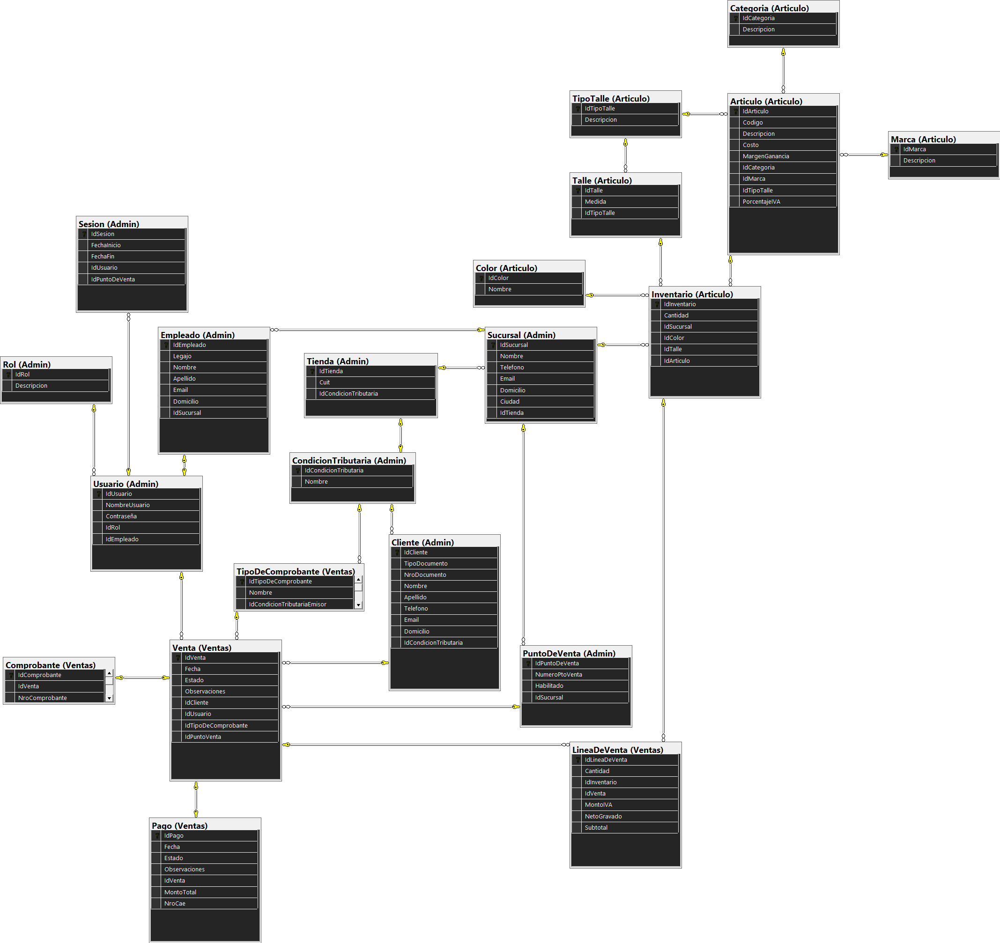
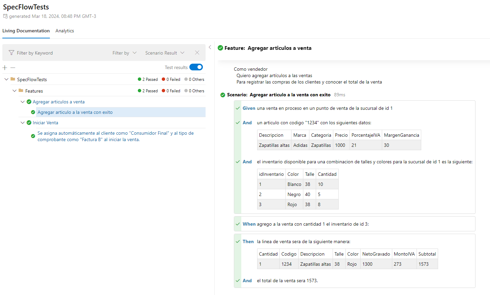

# TiendaAPI
Backend API en ASP.NET Core 7 para proyecto final de la materia Ingeniería de Software

## Diseño Clean Architecture orientado a Arquitectura 4 capas

## Diagrama de Clases

## Diagrama de Base de Datos

## Tests Automatizados
Podes chequear los últimos resultados en [LivingDocs - GitHub Pages](https://lucasdepetrisd.github.io/TiendaAPI/LivingDoc.html#/document/Standalone)

